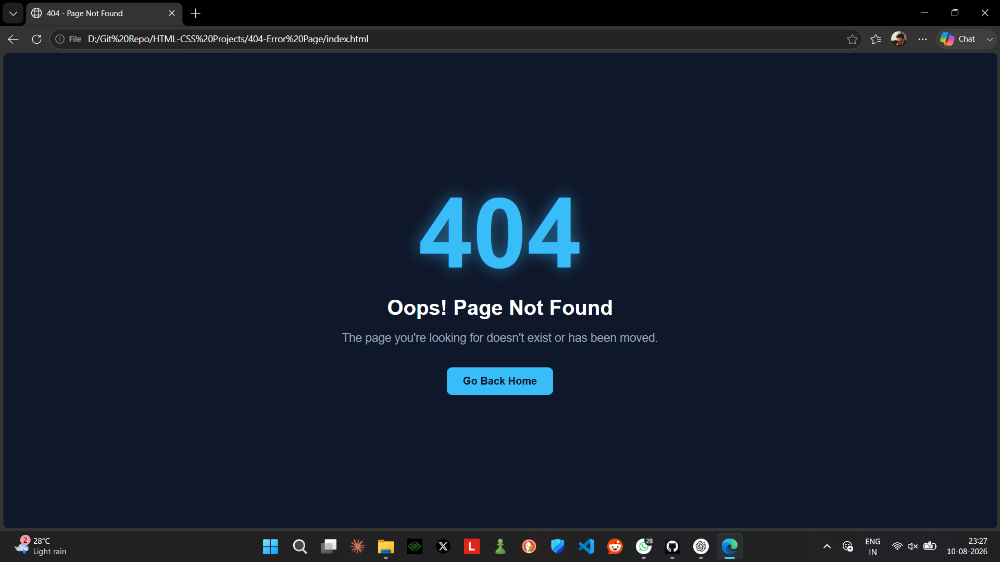

# 🚫 404 Error Page

A simple and modern **404 Error Page** built using **HTML and CSS**.

This project displays a clean error page when a user visits a page that doesn't exist. It includes a responsive layout, hover effects, and a "Go Back Home" button.

## 📸 Screenshot



> **Note:** Add your screenshot to the project folder and name it `screenshot.png`.

## ✨ Features

* 🎨 Modern dark UI
* 📱 Responsive design
* 💡 Clean and simple layout
* ✨ Hover animation on button
* 🔢 Large 404 error text
* 🏠 Home button
* 🌐 Works on desktop and mobile

## 🛠️ Technologies Used

* HTML5
* CSS3

## 📂 Project Structure

```text
404-error-page/
│
├── index.html
├── style.css
└── screenshot.png
```

## 🚀 How to Run

1. Clone this repository:

```bash
git clone https://github.com/your-username/404-error-page.git
```

2. Open the project folder.

3. Open `index.html` in your browser.

Or use **Live Server** in VS Code.

## 🎯 What I Practiced

* CSS Flexbox
* Responsive design
* CSS transitions
* Hover effects
* Button styling
* Typography
* Basic page layout

## 🔮 Future Improvements

* Add animated background
* Add floating elements
* Add a real home-page link
* Add JavaScript navigation
* Add more animations
* Add custom illustrations

## 👨‍💻 Author

**Shalabh Suman**

Built while learning **HTML & CSS** 🚀
