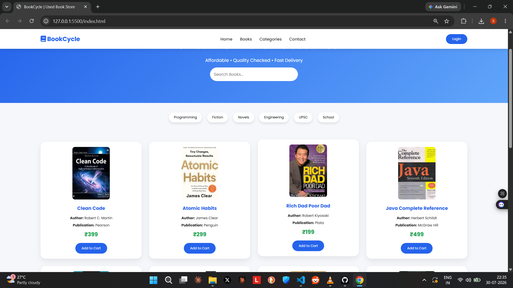

# 📚 BookCycle – Used Book Store

A simple and responsive **Used Book Store Website** built using **HTML5** and **CSS3**. The project displays a collection of second-hand books with their cover images, author names, publication details, prices, and an **Add to Cart** button. It features a clean and modern UI suitable for beginners learning front-end web development.

---



## 🚀 Features

- 📖 Responsive Book Store Homepage
- 🔍 Search Bar UI
- 📚 Book Categories Section
- 🖼️ Book Cards with Images
- ✍️ Author & Publication Details
- 💰 Book Prices
- 🛒 Add to Cart Buttons (UI)
- 📱 Mobile Friendly Design
- 🎨 Modern User Interface using CSS

---

## 🛠️ Technologies Used

- HTML5
- CSS3
- Google Fonts (Poppins)
- Font Awesome Icons

---

## 📂 Project Structure

```
BookCycle/
│── index.html
│── style.css
│── Book Images/
│     ├── clean code book.jpg
│     ├── atomic habits.jpg
│     ├── Rich Dad Poor Dad.jpg
│     ├── java.jpg
│     ├── python book.jpg
│     ├── let us c.jpg
│     ├── the alchemist.jpg
│     ├── wings of fire.jpg
│     ├── dbms.jpg
│     ├── computer networks.jpg
│     ├── data structure.jpg
│     └── think like a monk.jpg
│
└── README.md
```

---


---

## ▶️ How to Run

1. Download or clone the repository.

2. Open the project folder.

3. Double-click **index.html** or open it in your preferred browser.

---

## 🎯 Future Improvements

- Functional Shopping Cart
- User Login & Registration
- Book Search Functionality
- Filter Books by Category
- Wishlist
- Dark Mode
- Payment Gateway Integration
- Backend Database Support

---

## 👨‍💻 Author

**Shalabh Suman**

GitHub: https://github.com/heyshalabh

LinkedIn: https://linkedin.com/in/shalabh-suman

---

## ⭐ If you like this project

Give this repository a **Star ⭐** and feel free to fork it.
