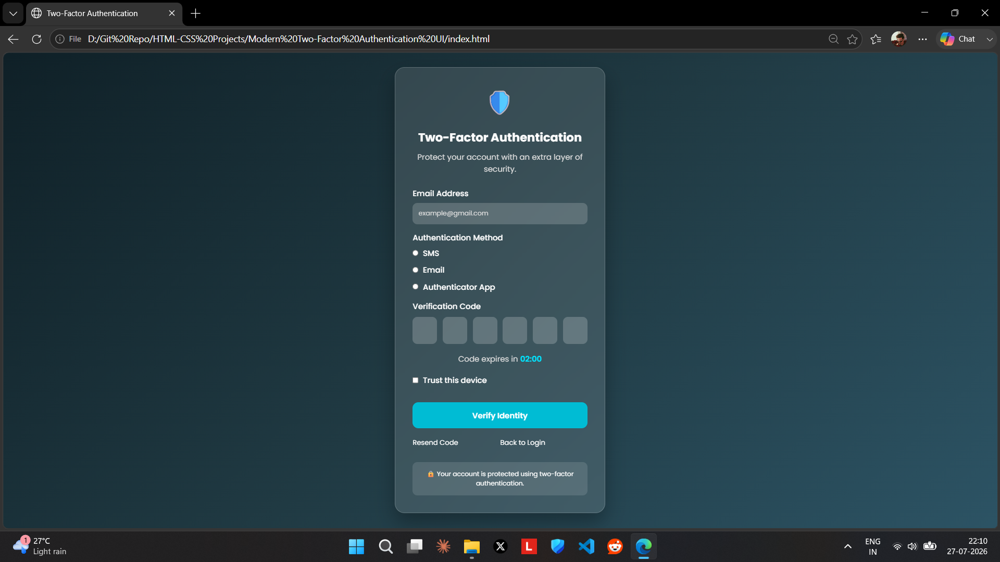

# 🛡️ Two-Factor Authentication UI

A modern and responsive **Two-Factor Authentication (2FA) Interface** built using **HTML5** and **CSS3**. This project features a sleek glassmorphism design with a gradient background, OTP verification fields, multiple authentication methods, and a clean user experience.

---

## 📸 Preview
```md

```

---

## ✨ Features

- 🔐 Modern Glassmorphism UI
- 📧 Email Address Input
- 📱 Multiple Authentication Methods
  - SMS Verification
  - Email Verification
  - Authenticator App
- 🔢 6-Digit OTP Input Boxes
- ⏳ OTP Expiration Timer
- ✅ Trust This Device Option
- 🔁 Resend Code Link
- 🔙 Back to Login Link
- 📱 Fully Responsive Design
- 🎨 Attractive Gradient Background
- ⚡ Smooth Hover Effects

---

## 🛠️ Technologies Used

- HTML5
- CSS3
- Google Fonts (Poppins)

---

## 📂 Project Structure

```
Two-Factor-Authentication-UI/
│
├── index.html
├── style.css
├── screenshot.png
└── README.md
```

---

## 🚀 Getting Started

1. Clone this repository

```bash
git clone https://github.com/yourusername/Two-Factor-Authentication-UI.git
```

2. Open the project folder.

3. Run `index.html` in your browser.

No installation or dependencies required.

---

## 🎯 Future Improvements

- JavaScript OTP Validation
- Countdown Timer Functionality
- Show Success/Error Messages
- Dark & Light Theme Toggle
- Backend Integration
- Real Email/SMS OTP Support

---

## 💡 Learning Objectives

This project helped practice:

- HTML Forms
- Responsive Layouts
- Flexbox
- Glassmorphism Design
- CSS Transitions & Hover Effects
- UI/UX Design Principles

---

## 📷 Screenshot

Replace the placeholder below with your own screenshot.

```
📸 Insert Screenshot Here
```

---

## 👨‍💻 Author

**Shalabh Suman**

- GitHub: https://github.com/heyshalabh
- LinkedIn: https://linkedin.com/in/shalabh-suman

---

## ⭐ Support

If you found this project helpful, consider giving it a **⭐ Star** on GitHub.
