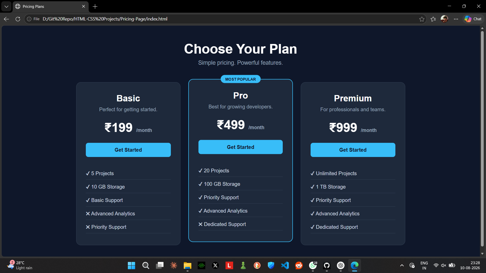

# 💳 Pricing Page

A modern and responsive **Pricing Page** built using **HTML and CSS**.

This project contains three pricing plans — **Basic, Pro, and Premium** — with a clean dark UI, responsive layout, hover effects, and a highlighted "Most Popular" plan.

## 📸 Screenshot




## ✨ Features

* 💳 Three pricing plans
* ⭐ Highlighted "Most Popular" plan
* 🎨 Modern dark-themed UI
* 🖱️ Hover animations
* 📱 Fully responsive design
* 📋 Feature comparison
* 🔘 Interactive-looking CTA buttons
* 📐 Clean card-based layout

## 🛠️ Technologies Used

* HTML5
* CSS3
* Flexbox
* CSS Media Queries
* CSS Transitions

## 📂 Project Structure

```text
pricing-page/
│
├── index.html
├── style.css
└── screenshot.png
```

## 🚀 How to Run

1. Clone the repository:

```bash
git clone https://github.com/your-username/pricing-page.git
```

2. Open the project folder.

3. Open `index.html` in your browser.

Or use **Live Server** in VS Code.

## 🎯 What I Practiced

* CSS Flexbox
* Responsive layouts
* Card design
* Hover effects
* CSS transitions
* Media queries
* Positioning elements
* Button styling

## 🔮 Future Improvements

* Add Monthly / Yearly pricing toggle
* Add JavaScript interactions
* Add light/dark mode
* Add payment integration
* Add animations
* Add FAQ section
* Add real checkout functionality

## 👨‍💻 Author

**Shalabh Suman**

Built while learning **HTML & CSS** 🚀
