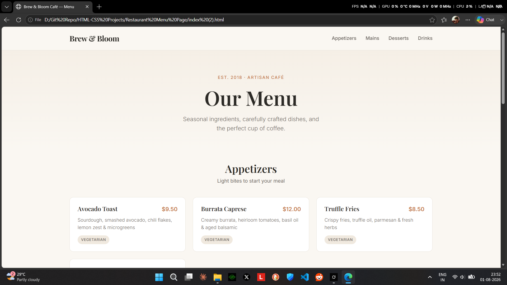

# Brew & Bloom Café — Menu Page

A clean, modern, and fully responsive restaurant/café menu page built with pure **HTML** and **CSS**.



## ✨ Features

- Elegant sticky header with smooth navigation
- Beautiful hero section
- Four menu categories: **Appetizers**, **Mains**, **Desserts**, and **Drinks**
- Responsive card-based layout
- Hover effects and subtle animations
- Tags for dietary info (Vegetarian, Gluten-Free, Chef’s Favorite)
- Mobile-friendly design
- Soft warm color palette with elegant typography

## 🛠️ Technologies Used

- HTML5
- CSS3 (Flexbox + CSS Grid)
- Google Fonts (Playfair Display & Inter)

## 📁 Project Structure

```
├── index.html
├── styles.css
├── screenshot.png
└── README.md
```

## 🚀 How to Use

1. Clone the repository:
   ```bash
   git clone https://github.com/your-username/brew-and-bloom-menu.git
   ```
2. Open `index.html` in your browser.

That’s it — no build tools or dependencies required!

## 📱 Responsive Design

The page looks great on:
- Desktop
- Tablet
- Mobile

## 🎨 Customization

You can easily change:
- Colors → Edit the CSS variables in `:root`
- Menu items → Update the content in `index.html`
- Fonts → Replace the Google Fonts link

## 📄 License

This project is open source and available under the [MIT License](LICENSE).
