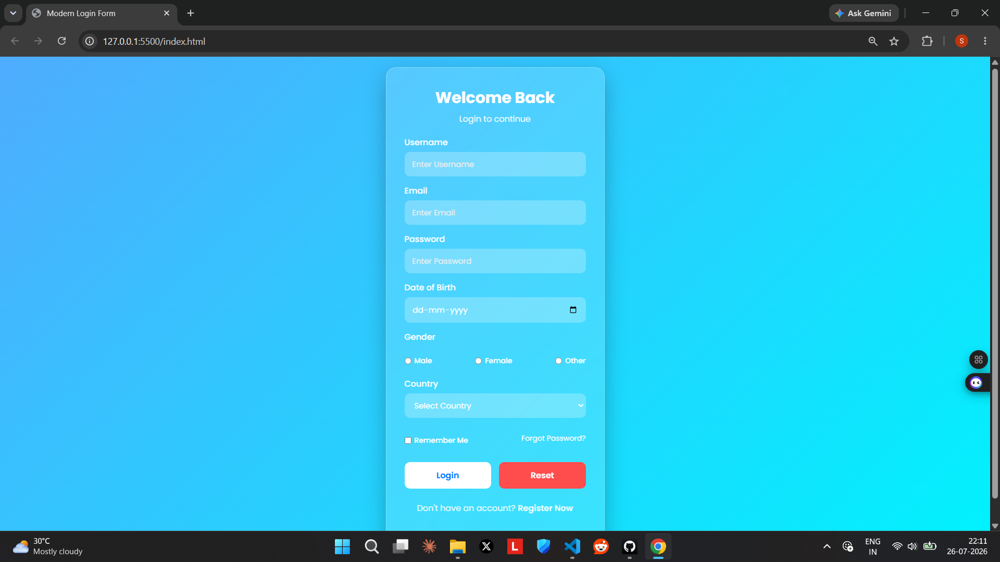

# Modern Login Form

A responsive and modern glassmorphism-style login form built with pure HTML and CSS.

## Features

- Clean glassmorphism design with backdrop blur
- Fully responsive (works on mobile & desktop)
- Form fields:
  - Username
  - Email
  - Password
  - Date of Birth
  - Gender (Radio buttons)
  - Country (Dropdown)
  - Remember Me checkbox
- Login & Reset buttons
- Smooth hover effects
- Modern Poppins font

## Technologies Used

- HTML5
- CSS3 (Flexbox, Backdrop Filter, Linear Gradient)
- Google Fonts (Poppins)

## How to Use

1. Clone or download this repository
2. Open `index.html` in your browser
3. That's it! No build tools required.

## File Structure
