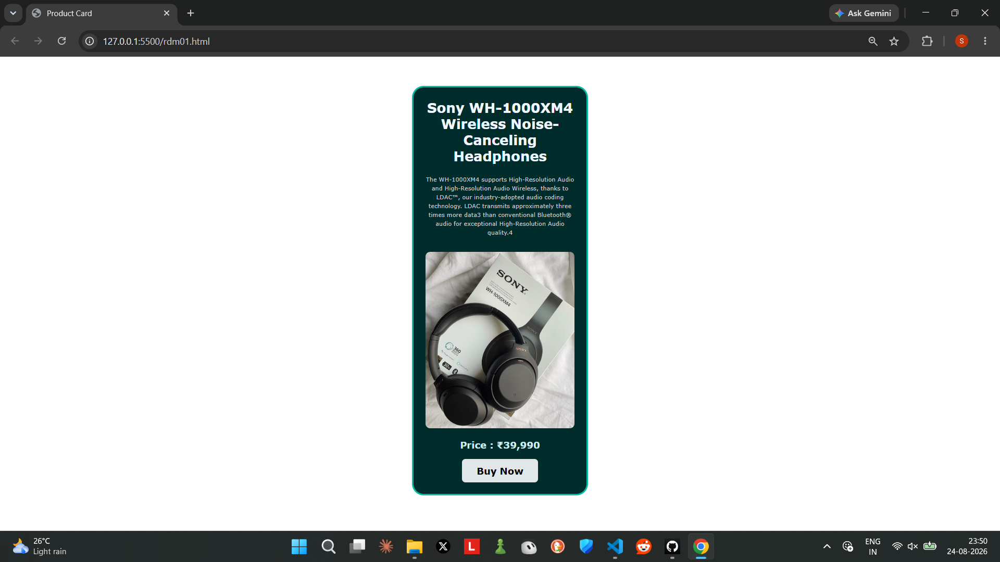

# 🎧 Sony Product Card

A simple **Product Card UI** built with **HTML5 and CSS3**.

## 📸 Screenshot



## ✨ Features

- Sony WH-1000XM4 product card
- Product title and description
- Product image
- Price display
- Styled **Buy Now** button
- Dark teal design
- Rounded corners and borders
- Clean spacing and typography

## 🛠️ Technologies Used

- HTML5
- CSS3

## 📁 Project Structure

```text
Product-Card/
├── rdm01.html
├── rdm01.css
└── product-card-screenshot.png
```

## 🎨 CSS Concepts Practiced

This project combines:

- CSS selectors
- Units
- Colors
- Fonts
- Text styling
- Box model
- Padding and margins
- Borders
- Border-radius
- Image styling
- Button styling

The card uses a fixed width, centered layout, padding, dark background, teal border, rounded corners, and centered text. fileciteturn0file0L9-L18

## 🧱 HTML Structure

The HTML contains the product card, heading, description, image, price, and Buy Now button. fileciteturn0file1L9-L21

## 🚀 How to Run

1. Keep `rdm01.html` and `rdm01.css` in the same folder.
2. Make sure the headphone image path used in the HTML exists.
3. Open `rdm01.html` in a browser.

## 📚 Practice Goal

The purpose of this project is to practice combining multiple basic CSS concepts into one complete UI component.

## 👨‍💻 Author

**Shalabh Suman**

B.Tech CSE Student | Aspiring Software Developer
