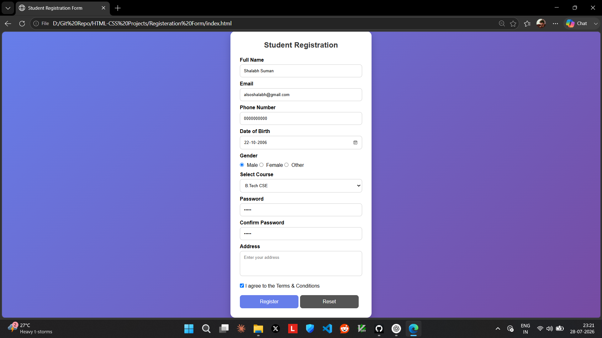

# 🎓 Student Registration Form UI

A clean and modern **Student Registration Form** built using **HTML5 and CSS3**.  
This project focuses on designing a simple, attractive, and user-friendly registration interface.


## 📸 Project Preview




## 🚀 Features

- ✅ Modern card-based UI design
- ✅ Gradient background
- ✅ Responsive registration form
- ✅ Personal information fields
- ✅ Gender selection
- ✅ Course dropdown menu
- ✅ Password fields
- ✅ Address section
- ✅ Terms & Conditions checkbox
- ✅ Submit and Reset buttons

---

## 🛠️ Technologies Used

- **HTML5** - Structure of the webpage
- **CSS3** - Styling and responsive layout

---

## 📂 Project Structure

```
Student-Registration-Form/
│
├── index.html
├── style.css
├── screenshot.png
└── README.md
```

---

## 📝 About The Project

The Student Registration Form is a beginner-friendly frontend project created to practice HTML forms and CSS styling.

It includes different form elements such as text inputs, radio buttons, dropdown menus, checkboxes, and text areas with a modern UI design.

---

## 🎯 Learning Outcomes

Through this project, I practiced:

- Creating structured HTML forms
- Styling form elements using CSS
- Using CSS layouts and spacing
- Creating modern UI components
- Improving frontend design skills

---

## 🔮 Future Improvements

- Add JavaScript form validation
- Add password visibility toggle
- Add password strength checker
- Add profile image preview
- Connect with backend database
- Add dark mode

---

## 👨‍💻 Author

**Shalabh Suman**

B.Tech CSE Student | Aspiring Software Developer

GitHub: [heyshalabh](https://github.com/heyshalabh)

---

⭐ If you like this project, consider giving it a star!