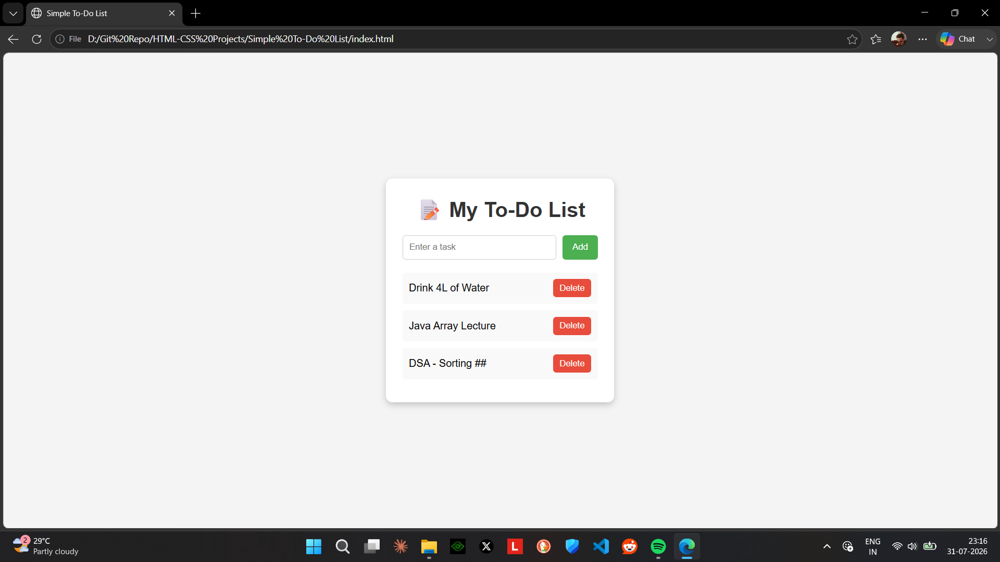

# 📝 Simple To-Do List

A clean and beginner-friendly **To-Do List** web application built using **HTML**, **CSS**, and a small amount of **JavaScript**. This project allows users to add, complete, and delete tasks through a simple and responsive interface.

---



## 🚀 Features

- ➕ Add new tasks
- ✅ Mark tasks as completed
- ❌ Delete tasks
- 🎨 Clean and minimal user interface
- 📱 Responsive design
- 💡 Beginner-friendly project

---

## 🛠️ Technologies Used

- HTML5
- CSS3
- JavaScript (Basic DOM Manipulation)

---

## 📂 Project Structure

```
Todo-List/
│── index.html
│── style.css
│── screenshot.png
└── README.md
```

---


---

## ▶️ How to Run

1. Download or clone this repository.
2. Open the project folder.
3. Double-click **index.html** or open it in your preferred web browser.

No installation or additional software is required.

---

## 📖 How to Use

1. Type a task into the input field.
2. Click the **Add** button to add it to the list.
3. Click on a task to mark it as completed.
4. Click the **Delete** button to remove a task.

---

## 🎯 Learning Objectives

This project helps beginners understand:

- HTML page structure
- CSS styling and layouts
- Flexbox
- Basic JavaScript
- DOM Manipulation
- Event Handling

---

## 🌟 Future Improvements

- Save tasks using Local Storage
- Edit existing tasks
- Add task categories
- Due dates and reminders
- Dark mode
- Task filtering (All / Completed / Pending)

---

## 👨‍💻 Author

**Shalabh Suman**

GitHub: https://github.com/heyshalabh

---

## 📄 License

This project is open-source and available under the **MIT License**.