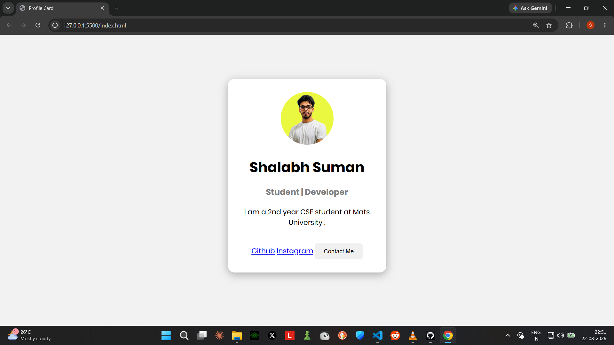

# 👤 Profile Card

A simple and clean **Profile Card** built using **HTML and CSS**.
This project displays a personal profile with a profile picture, name, role, short introduction, social links, and a contact button.



## ✨ Features

* 👤 Circular profile picture
* 📝 Name and professional/student title
* 📄 Short profile description
* 🔗 GitHub and Instagram links
* 📩 Contact Me button
* 🎨 Clean and minimal card design
* 🌑 Soft shadow and rounded corners
* 📱 Simple responsive-friendly layout

## 🛠️ Technologies Used

* **HTML5**
* **CSS3**

The HTML contains the profile card structure, while CSS handles the layout, typography, spacing, colors, rounded corners, and shadows.

## 📂 Project Structure

```text
Profile-Card/
│
├── index.html
├── style.css
├── profile.jpeg
└── screenshot.png
```

## 🚀 How to Run

1. Download or clone this repository.
2. Make sure all files are inside the same folder.
3. Open `index.html` in your browser.
4. Your profile card will be displayed.

## 👨‍💻 About

**Shalabh Suman**
Student | Developer
2nd Year CSE Student at MATS University.

## 📌 Project Purpose

This project was created as a beginner-friendly HTML & CSS practice project to understand:

* HTML structure
* CSS styling
* Card layouts
* Images
* Links and buttons
* Border radius and box shadows

## 📄 License

This project is open-source and available for learning and educational purposes.
